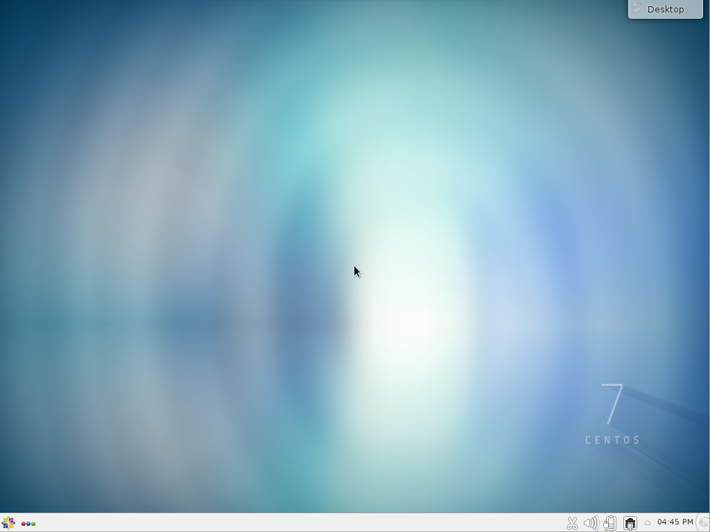

# Student training VM
This document defines the use of the student VM, which will run the KDE windowing environment on CentOS 7.

## Pre-requisites
* Installation of Vagrant from https://www.vagrantup.com/
* Installation of VirtualBox from https://www.virtualbox.org/wiki/Downloads

## What the VM contains

The system comes with minimal installed software, so the students will need to install software as and when they require it to become familiar with how to install software on a Linux system.

Some software is installed by default;
* MariaDB (MySQL server and command line)
* KDE (Windowing environment)
* VI and VIM
* Kernel Development (to enable guest additions)

All software required for the course is installed on to the VM in the following locations;

### RPMs
```
/var/localrepo
```
This repository is a real YUM repository and the vagrant build disables all other repositories apart from this one.
Students can install software from this repository without any Internet connection.

### Eclipse
```
/var/eclipse
```
Eclipse Java and JEE install packages are located in this directory for installation where no network is available.  The following plugins are also in there;
* PMD
* FindBugs
* eclemma

The ECLEmma file will work with the Eclipse Install Software when added as a repository.  The other 2 will need to be manually extracted and copied as per instructions Installing Eclipse Plugins locally.

### Other software
Any other software is located in
```
/var/othersw
```
These are non-rpm packages and are either tar.gz, or zip files.  Currently this includes;
* Maven 3.5.0
* TeamCity 2017.1.2
* ActiveMQ 5.14.5
* Wildfly 10.1.0
* Kibana 4.2.0 (for ELK stack)
  * Logstash and Elasticsearch are in the RPMs

## installation
```
vagrant up cvm
```

This will call the script bin/citivm.sh to provision the VM.

The VM will open a VirtualBox window with the VM running in it since it will require GUI display.

## Cloning
Once the VM has been created through Vagrant you will need to manually complete the installation:
1. accept the license
2. install latest VirtualBox Guest Additions
3. set the GB keyboard (if required)

### Complete CentOS Installation

* Start the VM from the GUI manager if it isn't running
* If the VM does not display a screen with a Finish Configuration button at the bottom right restart the VM
* Click on the VM window and click on OK to allow the VM to capture the mouse: you can press the right hand Ctrl key to release the mouse at any time
* Click in the Licensing icon with the warning triangle, check the option to accept the license and click Done (top left of screen)
* Click Finish Configuration at bottom right and the VM will restart: you may need to press the right Ctrl key to release the mouse at this point
After a reboot you should have the usable graphical interface:



### Update Guest Additions
**Using Shell Scripts**
Before performing the export you should also perform any other installations of software that you think should be in place for the students.  You should also add the Guest Additions, either manually or using the scripts **add-cd.sh** and **bin/install-additions.sh** scripts as follows;
* Shutdown the VM (only if)
  * ```vagrant halt cvm```
* Add the CD Rom drive and guest additions
  * ```bin/add-cd.sh```
* Start the VM
  * ```vagrant up cvm```
* Install guest additions
  * ```bin/install-additions.sh NeuedaC cvm```

This will install the guest additions.  Note that you may have to have the grads perform this step if a different version of VirtualBox is in use.

**Manually**
The VM already has Guest Additions installed but you should upgrade to the version supplied with your version  of VirtualBox.
* On the Device menu select Insert the Guest Additions CD
* Hopefully you will see a popup for the Optical disk in which case:
   * choose the File Manager option
   * in the File Manager select the Control popdown menu, select Tools then Open Terminal
* If you don't see the Optical Disk window or the popup closes:
   * start a terminal window by Right clicking on the desktop and selecting Konsole
   * in the terminal change to the mounted CD directory:
   * `cd run/media/student/VBOXADDITIONS_*`  
* From the terminal install the Guest additions as root with:
* `sudo ./BoxLinuxAdditions.run`
* After installation reboot the VM
  * Test installation is successful by resizing the VM window and the Linux desktop should resize to fit the new window dimensions
  * you can check the version of Guest Additions in use by looking in `/opt` for the `VBoxGuestAdditions*` folder
* Finally remove the Guest Additions CD through the Devices menu, Optical Disks and remove disk - you will probably have to select Force unmount from the popup window

### Set GB keyboard if not configured

You can check if you keyboard settinsg are correct by starting a terminal window (right click on desktop and choose Konsole):
* press symbols keys such as | ~ @ and check they display correctly

If the keyboard settings are wrong:
* Click on the _menu_ icon (bottom left) and select System Settings
* Scroll down and click on Input Devices
* Ensure Keyboard is selected at the left and click on the Layouts tab
* Check Configure Layouts and click on Add
* In the popup from the drop down lists choose English, then English (UK) and click on OK (for the default keyboard layout)
* Select the English (UK) row and click on Move Up to make it the default layout
* click on Apply
* close the window and start a terminal window - right click on the desktop and choose Konsole
* press the | ~ @ keys to verify they are now correct

### Step for exporting;
* Click file
* Select Export Appliance
* Select the NeuedaC VM name
* Click Next
* Set the location of where you want the file to be created
* Click Next
* Click Export

Once the export process has finished go to the directory you specified above, and you should see the OVA file.  Copy this file to your USB drive and on to the other PCs.

Using VirtualBox management interface;
* Click file
* Select Import Appliance
* Locate the OVA file you have copied to the new PC
* Click Next

# Notes
The Vagrant build is intended as a continual forward install, so if something fails you should be able to fix the issue and run;
```
vagrant provision cvm
```
This is done while the VM is running.

Login to the VM is;
student
neueda

## Installing Eclipse Plugins locally.
2 methods;
* Help -> Install software
  * Go to the /var/eclipse directory and select the ZIP file
  * If eclipse does not complain then you can install using this method
* Manually
  * Unzip the plugin
  * Copy the content of the plugin directory to your eclipse/plugin directory
  * If there is a features directory copy the content of that to eclipse/features
  * Restart eclipse

## Checking the plugin installed;
* Select Help
* Select About Eclipse
* Click Installation Details
* Click the Plug-ins tab
* Start typing in the name of the plugin, e.g. findbug

## Keyboard mapping issues
If your UK keyboard is not responding to the correct pipe symbol mapping do the following;
* Go to the start menu
* Type **keyboard**
* Click **Keyboard** when it appears in the list, only Keyboard not the others
* Click the Layouts tab
* Tick the **Configure layouts** check box
* Click the Add button
* Change the **Limit selection by language** to English
* Change **Layout** to English (UK)
* Click OK
* Click OK

Your keyboard should now work.
