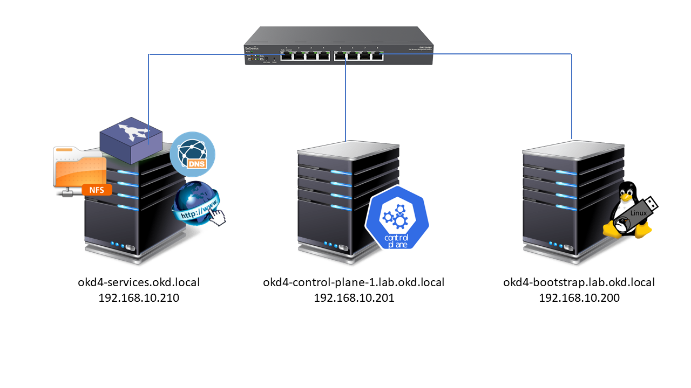

# OKD 4 Single Node Cluster

The set up of this project is to enable a standalone OpenShift 4 installation.

The files here are a modification to https://github.com/CountPickering/okd4_files.git, which should work, but you need to modify your IP address range in the following files;
- named.conf
- db.192.168.10
- db.okd.local
- haproxy.cfg
- registry_pv.yaml

Even using OKD this requires 3 machines still to resolve the issue.

1. A Services machine
    - okd4-services.okd.local.
    - 192.168.10.210
    - Runs the following services
      - DNS, HAProxy, HTTP on port 8080
2. A Bootstrap node
    - okd4-bootstrap.lab.okd.local.
    - 192.168.10.200
3. A control-plane
    - okd4-control-plane-1.lab.okd.local.
    - 192.168.10.201

Make sure you use these IP addresses in your set up, when you get to the coreos installer.

## What's in this project

There is a services system that can be started with **vagrant up**, and will launch the following items on that server:
- DNS server
    - preconfigured with the necessary names and IPs mentioned above
- HAProxy server
    - preconfigured with the necessary connections for the SNC system
- Web server
    - Preconfigured with the raw OS image and the ignition files to build the cluster
- DHCP PXE server
    - Preconfigured to make it easier to launch the Bootstrap and Control-Plane servers
    - This includes the TFTP and FTP servers

### Bootstrap and Control-plane

These servers must be booted with the right MAC addresses.  If using a VM you can change the MAC on the VM configuration:

- Bootstrap
    - 08:00:27:81:45:E3
    - This is in the pxe.sh configuration file. Search for __host okd4-bootstrap.lab.okd.local__ if you need to change the MAC
- Control-plane
    - 08:00:27:5E:E3:AB
    - This is in the pxe.sh configuration file. Searc for __host okd4-control-plane-1.lab.okd.local__ of upi meed tp change the MAC

Using this method the servers will automatically have the relevant configuration parameters passed to them during the boot process, and you don't need to download the CORE OS image.

## Potential debugging issues

Use the following to help with any issues you may find in the log files.

**NOTE:** The /etc/nsswitch.conf file on all machines needs to be modified so the hosts line is:

```
hosts:      files myhostname dns resolve [!UNAVAIL=return] dns
```

The **dns** needs to be before resolve.  Without this working it all hangs and **journalctl -xe** will report host lookup failures.

## Useful guides

This guide https://medium.com/swlh/guide-okd-4-5-single-node-cluster-832693cb752b makes a good start, but it doesn't change the IP addresses according to his network set up.  So poor show there, and a wonder how he got it to work.

The bare metal install method https://docs.okd.io/latest/installing/installing_bare_metal/installing-bare-metal.html#installing-bare-metal gives some explanations of the key parts mentioned in the above example.

## Pre-requisites

Before starting you will need the following ISO images
- Fedora 37 Server
  - This will be used to build the services server, although you can use any RHEL derived OS such as CentOS or AlmaLinux, since this will have DNS, HAPROXY and HTTPD installed.
  - https://download.fedoraproject.org/pub/fedora/linux/releases/37/Server/x86_64/iso/Fedora-Server-dvd-x86_64-37-1.7.iso
- CoreOS Bare Metal
  - This will be used to boot the bootstrap and control-plane nodes
  - https://builds.coreos.fedoraproject.org/prod/streams/stable/builds/37.20230303.3.0/x86_64/fedora-coreos-37.20230303.3.0-live.x86_64.iso

3 Virtual machines or physical machines
- Services Node
  - This is the one running DNS, HAPROXY and HTTPD
  - 2 vCPU
  - 2GB RAM
  - 100GB disk
  - IP: 192.168.10.210
- Bootstrap
  - 4 vCPU
  - 4GB RAM
  - 120GB disk
  - IP: 192.168.10.200
- Control-plane
  - 8 vCPU
  - 16GB RAM
  - 120GB disk
  - IP: 192.168.10.201



# Building the Services node

- We'll assume you've already installed a RHEL derived OS on to your **Services** server, if you haven't installed it with the Fedora 37 iso.
- Make sure you set the network IP address on this node as mentioned earlier.

## Installing the services

### First let's update the server

```
sudo dnf -y update
sudo dnf -y install wget git vim
sudo init 6
```

NOTE: replace **dnf** with **yum** for non-Fedora systems.

### Install DNS


- Install Bind packages

```
sudo dnf -y install bind bind-utils
```

- Copy the named.conf file from here to /etc/named.conf
- Create the /var/named directory
    ```
    sudo mkdir /var/named
    ```
- Copy the db.192.168.10, db.okd.local and localhost.zone to /var/named/
- Start the DNS service
    ```
    sudo systemctl enable --now named
    ```
- Check it is running
    ```
    sudo systemctl status named
    ```
- Turn of the firewall
    ```
    sudo systemctl disable --now firewalld
    ```

- Prevent NetworkManager for changing /etc/resolv.conf
  - Edit /etc/NetworkManager/NetworkManager.conf
    - Add the following after the [main] section:
        ```
        dns=none
        ```
- Edit /etc/resolv.conf and set the contents to:
    ```
    search okd.local
    nameserver 127.0.0.1
    ```
- Check DNS is working
    ```
    nslookup okd4-services
    ```
    and
    ```
    nslookup api.lab
    ```

    NOTE: You don't need to put okd.local as the **search** in /etc/resolv.conf is doing this for us.
    If nslookup does not work use dig.

### Install HAProxy

- Install packages
    ```
    sudo dnf -y install haproxy
    ```
- Copy the haproxy.cfg in this project to /etc/haproxy/haproxy.cfg
- Start and check HAProxy runs
    ```
    sudo setsebool -P haproxy_connect_any 1
    sudo systemctl enable --now haproxy
    sudo systemctl status haproxy
    ```
- Check HAProxy is up by checking the stats page
    - http://192.168.10.210:9000/

### Install the web service

Why do we need a web service?

All of the configuration for the 2 servers and the boot images will be served from here.

- Install packages
    ```
    sudo dnf -y install httpd
    ```
- Set the listen port to 8080
    ```
    sudo sed -i 's/Listen 80/Listen 8080/' /etc/httpd/conf/httpd.conf
    ```

    This is just in case, should be OK on 80.
- Enable and start HTTPD
    ```
    sudo setsebool -P httpd_read_user_content 1
    sudo systemctl enable --now httpd
    ```
- Check it is running correctly
    ```
    curl localhost:8080
    ```

    You should see some raw HTML.

## Configuring the cluster files

Here you will configure the cluster files and set up the web server to server all configuration files and images.

### Download openshift-install and oc

You should check https://github.com/okd-project/okd/releases for the latest versions of **client** and **install**.  Below we will be grabbing 4.12

- Download the files
    ```
    cd /tmp
    wget https://github.com/okd-project/okd/releases/download/4.12.0-0.okd-2023-03-18-084815/openshift-client-linux-4.12.0-0.okd-2023-03-18-084815.tar.gz
    wget https://github.com/okd-project/okd/releases/download/4.12.0-0.okd-2023-03-18-084815/openshift-install-linux-4.12.0-0.okd-2023-03-18-084815.tar.gz
    ```
- Extract the files
    ```
    tar xvf openshift-client-linux-4.12.0-0.okd-2023-03-18-084815.tar.gz
    tar xvf openshift-install-linux-4.12.0-0.okd-2023-03-18-084815.tar.gz
    ```
- Move the files to executable location
    ```
    sudo mv kubectl oc openshift-install /usr/bin
    ```
- Remove the downloaded files
    ```
    rm *.tar.gz
    ```
- Generate an SSH key.  This will be the coreos user log on key.
    ```
    ssh-keygen
    ```

    If you don't already have an SSH key pair accept the defaults. This will create a private key called id_rsa and a public key called id_rsa.pub in $HOME/.ssh.
- Return to you home directory
    ```
    cd
    ```
- Let's now create the configuration files for the cluster.  Make a directory called **install_dir**
    ```
    mkdir install_dir
    ```
- Modify the **install-config.yaml** file and copy the content of **$HOME/.ssh/id_rsa.pub** over the top of **ssh-ed25519 AAAA...**.  Make sure you leave the quotes either side of your key.  This is the **sshKey** section.
- Copy the **install-config.yaml** from this project into that directory you just created called **install_dir**
- Generate the Kubernetes manifests for the cluster, ignore the warning
    ```
    openshift-install create manifests --dir=install_dir/
    ```
- If you want a backup copy of the manifests, make sure you take a copy of the **install_dir** now, e.g.
    ```
    cp -r install_dir manifests_dir
    ```

    The install_dir content will be changed with the next command.  Making a copy is not as essential as keeping a copy of your original **install-config.yaml**.
- Now you can create the ignition-configs
    ```
    openshift-install create ignition-configs --dir=install_dir/
    ```

Now we have our cluster config files we need to add them to the web server.

### The web server files

- Make a directory called okd4 for the web service
    ```
    sudo mkdir /var/www/html/okd4
    ```
- Copy the files from the install_dir
    ```
    sudo cp -R install_dir/* /var/www/html/okd4/
    sudo chown -R apache: /var/www/html/
    sudo chmod -R 755 /var/www/html/
    ```
- Check the web server
    ```
    curl localhost:8080/okd4/metadata.json
    ```
- Download the Fedora Core OS bare metal raw image and sig file and the gpg key.
    ```
    cd /var/www/html/okd4
    sudo wget https://builds.coreos.fedoraproject.org/prod/streams/stable/builds/37.20230303.3.0/x86_64/fedora-coreos-37.20230303.3.0-metal.x86_64.raw.xz
    sudo wget https://builds.coreos.fedoraproject.org/prod/streams/stable/builds/37.20230303.3.0/x86_64/fedora-coreos-37.20230303.3.0-metal.x86_64.raw.xz.sig
    sudo curl -O https://getfedora.org/static/fedora.gpg
    ```
- Rename the files for ease
    ```
    sudo mv fedora-coreos-37.20230303.3.0-metal.x86_64.raw.xz fcos.raw.xz
    sudo mv fedora-coreos-37.20230303.3.0-metal.x86_64.raw.xz.sig fcos.raw.xz.sig
    ```
- Add the signature to the server.  If we don't do this then the installs will fail
    ```
    gpgv --keyring ./fedora.gpg fcos.raw.xz.sig fcos.raw.xz
    ```
- Set the ownership and permissions
    ```
    sudo chown -R apache: /var/www/html/
    sudo chmod -R 755 /var/www/html/
    ```

That's the configuration done, now time to install the cluster.

## Starting the bootstrap node

With the ISO image of CoreOS Bare Metal attached to your Bootstrap node, start the system and boot from CD.

When you see the **Fedora CoreOS** screen press the **TAB** key.

You will see a line containing:
```
> /images/vmlinuz initrd=/images/initramfs.img .....
```

We will add to the end of this line with the following, after adding a space:
```
ip=192.168.10.200::192.168.10.1:255.255.255.0:::none nameserver=192.168.10.210 coreos.inst.install_dev=/dev/sda coreos.inst.image_url=http://192.168.10.210:8080/okd4/fcos.raw.xz coreos.inst.ignition_url=http://192.168.10.210:8080/okd4/bootstrap.ign
```

NOTE: 192.168.1.1 should be replaced with the IP address of your gateway/router.

If you don't have the ability to use the ISO, but you have a Core OS system you can use the installer in core os.

```
sudo coreos-installer install /dev/sda --ignition-url http://192.168.10.210:8080/okd4/bootstrap.ign --image-url http://192.168.10.210:8080/okd4/fcos.raw.xz --insecure-ignition --insecure
```


## Start the control-plane

Boot the control-plane with the ISO image of CoreOS Bare Metal attached.

When you see the **Fedora CoreOS** screen press the **TAB** key.

We will add to the end of this line with the following, after adding a space:
```
ip=192.168.10.201::192.168.10.1:255.255.255.0:::none nameserver=192.168.10.210 coreos.inst.install_dev=/dev/sda coreos.inst.image_url=http://192.168.10.210:8080/okd4/fcos.raw.xz coreos.inst.ignition_url=http://192.168.10.210:8080/okd4/master.ign
```

If you don't have the ability to use the ISO, but you have a Core OS system you can use the installer in core os.

```
sudo coreos-installer install /dev/sda --ignition-url http://192.168.10.210:8080/okd4/master.ign --image-url http://192.168.10.210:8080/okd4/fcos.raw.xz --insecure-ignition --insecure
```

## Monitor the bootstrap

You can monitor the bootstrap process from the okd4-services node:

```
openshift-install wait-for bootstrap-complete --dir install_dir/ --log-level info
```

Messages
```
INFO API v1.25.0-2786+eab9cc98fe4c00-dirty up
INFO Waiting up to 30m0s (until 9:51AM) for bootstrapping to complete... 
```


Once the bootstrap process is complete, which can take upwards of 30 minutes, you can shutdown your bootstrap node. Now is a good time to edit the /etc/haproxy/haproxy.cfg, comment out the bootstrap node, and reload the haproxy service.

These next lines can be executed on the Services node when the **okd4-bootstrap** turns read on the HAProxy stats page - https://192.168.10.210:9000/

```
sudo sed -i '/ okd4-bootstrap /s/^/#/' /etc/haproxy/haproxy.cfg
sudo systemctl reload haproxy
```

You can check the install progress by logging on to the control-plane host from the services host:

```
ssh core@192.168.10.201
journalctl -xe -f
```

## Login to cluster

Now that the control-plane node is online, you should be able to login with the oc client. Use the following commands to log in and check the status of your cluster from the service node:

```
export KUBECONFIG=~/install_dir/auth/kubeconfig
oc whoami
oc get nodes
```


Check the status of the cluster operators.

```
oc get clusteroperators
```


Once the console operator is available login to the web console. Get your kubeadmin password from the install_dir/auth folder on the service node:

```
cat install_dir/auth/kubeadmin-password
```


Open your web browser to https://console-openshift-console.apps.lab.okd.local/ and login as kubeadmin with the password from above.  Note you'll need to make sure that the host you are using has been pointed to your **services** server as it's primary DNS.


The cluster status may still say upgrading, and it continues to finish the installation.


## Persistent Storage

We need to create some persistent storage for our registry before we can complete this project. Let’s configure our okd4-services VM as an NFS server and use it for persistent storage.

Login to your **okd4-services** node and begin to set up an NFS server. The following commands install the necessary packages, enable services, and configure file and folder permissions.

```
sudo dnf install -y nfs-utils
sudo systemctl enable nfs-server rpcbind
sudo systemctl start nfs-server rpcbind
sudo mkdir -p /var/nfsshare/registry
sudo chmod -R 777 /var/nfsshare
sudo chown -R nobody:nobody /var/nfsshare
```

Create an NFS Export

Add this line in the new /etc/exports file "/var/nfsshare 192.168.10.0/24(rw,sync,no_root_squash,no_all_squash,no_wdelay)"

```
echo '/var/nfsshare 192.168.60.0/24(rw,sync,no_root_squash,no_all_squash,no_wdelay)' | sudo tee /etc/exports
```

## Registry configuration

Create a persistent volume on the NFS share. Use the registry_py.yaml in okd4_files folder from the git repo:

```
oc create -f okd4_files/registry_pv.yaml
oc get pv
```


Edit the image-registry operator:

```
oc edit configs.imageregistry.operator.openshift.io
```

Change the managementState: from Removed to Managed. Under storage: add the pvc: and claim: blank to attach the PV and save your changes automatically:

```
managementState: Managedstorage:
    pvc:
      claim:
```


Check your persistent volume, and it should now be claimed:

```
oc get pv
```


Check the export size, and it should be zero. In the next section, we will push to the registry, and the file size should not be zero.

```
du -sh /var/nfsshare/registry
```


Now launch your projects.  See https://medium.com/swlh/guide-okd-4-5-single-node-cluster-832693cb752b for launching wordpress.